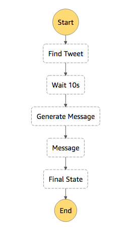

# Step Functions Code Along

* Create CloudFormation stack - ./deploy
* Clean resources - ./cleanup

## Step 0 - Prerequisites
[Create AWS account with IAM user that has administrator permissions](prerequisites.md)

## Step 1 - Create Lambda functions
    aws cloudformation create-stack --stack-name functions --template-body file://functions.yml --capabilities CAPABILITY_IAM

Verify it: `aws lambda list-functions`

## Step 2 - Create the state machine
    aws cloudformation create-stack --stack-name call-center --template-body file://call-center.yml --capabilities CAPABILITY_IAM

Verify it: `aws cloudformation list-stacks`

## Step 3 - Execute the state machine
* Search for Step Functions
* Click on MyStateMachine
* Click 'Start execution'

Type this in the input box:

    {
      "inputCaseID": "001"
    }

* Click 'Start execution'
