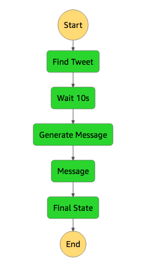

# Step Functions Code Along
In this code along session, you will learn how to use AWS Step Functions to design and run a serverless workflow that coordinates multiple AWS Lambda functions.

In our example, you are a developer who has been asked to create a serverless application to automate handling of support tickets in a call center. While you could have one Lambda function call the other, you worry that managing all of those connections will become challenging as the call center application becomes more sophisticated. Plus, any change in the flow of the application will require changes in multiple places, and you could end up writing the same code over and over again.

To solve this challenge, you decide to use AWS Step Functions. Step Functions is a serverless orchestration service that lets you easily coordinate multiple Lambda functions into flexible workflows that are easy to debug and easy to change. Step Functions will keep your Lambda functions free of additional logic by triggering and tracking each step of your application for you.

In the next 30 minutes, you will create a Step Functions state machine to describe the current call center process, create a few simple Lambda functions that simulate the tasks of the support team, and pass data between each Lambda function to track the progress of the support case. Then, you’ll perform several tests of your workflow to observe how it responds to different inputs. Finally, you’ll delete the AWS resources you used in the tutorial.

You'll use AWS Step Functions and AWS Lambda in this tutorial. These services are within the AWS Free Tier.


## Step 0 - Prerequisites
[Create AWS account with IAM user that has administrator permissions](prerequisites.md)

## Step 1 - Create Lambda functions
Run the following command:

```
aws cloudformation create-stack --stack-name functions --template-body file://functions.yml --capabilities CAPABILITY_IAM
```

Verify it by running this command: `aws lambda list-functions` and also look at the AWS Web Console under 'Lambda'.

## Step 2 - Create the state machine
1. Update the state machine file with your AWS Account ID by running this script: `./replace-account-id.sh`
1. Run the following command:

```
aws cloudformation create-stack --stack-name call-center --template-body file://call-center.yml --capabilities CAPABILITY_IAM
```

Verify it by running this command: `aws stepfunctions list-state-machines` and also look at the AWS Web Console under Step Functions.

## Step 3 - Execute the state machine
* Search for Step Functions at the AWS Web Console
* Click on MyStateMachine
* Click 'Start execution'

Type this in the input box:

    {
      "inputCaseID": "001"
    }

* Click 'Start execution'

## Step 4 - Oberve the input and output of the states
Click on any state to see the inputs and outputs




